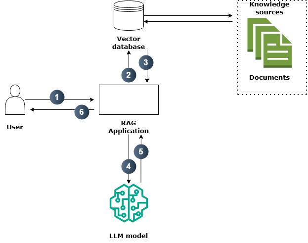
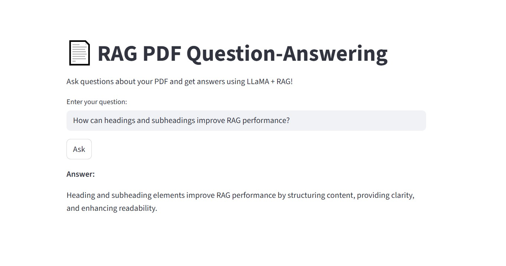

# RAG PDF Question-Answering with LLaMA

This project demonstrates how to build a **Retrieval-Augmented Generation (RAG) pipeline** for PDF documents using:

- **LLaMA 3.2** (local GGUF model)
- **SentenceTransformers** for embeddings
- **Chroma** vector database
- **Streamlit** for an interactive web interface
- **PyPDF2** for PDF reading

Users can ask questions about a PDF, and the system retrieves relevant content and generates answers.

---
## 🔁 RAG Workflow


## Features

- Load and split PDF documents into smaller chunks
- Create embeddings with `SentenceTransformer`
- Store embeddings in a persistent **Chroma vector database**
- Query PDF content interactively using **LLaMA**
- Streamlit app for live Q&A with multiple questions
- Modular code for easy reuse

---

## 💡 Example: Streamlit App in Action

Once you run the Streamlit app, you’ll see an interface like this:


Ask questions about your PDF (for example):

## Requirements

- Python 3.10+
- Libraries (can be installed via `requirements.txt`):

```bash
pip install -r requirements.txt
```
---

## Project Structure
```
.
├── data/
│   └── vector_store/        # Vector DB storage (ignored by git)
├── models/
│   └── Dolphin3.0-Llama3.2-1B-Q4_K_M.gguf   # Local LLaMA model (ignored by git)
├── src/
│   ├── ingest_pdf.py        # Load PDF and extract text
│   ├── split_text.py        # Split text into chunks
│   ├── create_vectorstore.py # Create embeddings & Chroma vector store
│   ├── RAG_pipeline.py      # Main functions: ask_question, load_llama_model
│   └── app.py               # Streamlit app
├── requirements.txt
└── README.md
```
---

## Project Setup
### 1. Clone the repository

```bash
git clone https://github.com/Hashem-Qaryouti/llama3-rag-pipeline.git
cd <your-repo-name>
```
### 2. Create and activate a virtual environment
```bash
python -m venv llama_env
```
#### Activate the environment:
- **Windows:**
```bash
llama_env\Scripts\activate
```
- **Linux:**
```bash
source llama_env/bin/activate
```
### 3. Install dependencies
```bash
pip install -r requirements.txt

```

### 4. Add your PDF
Place your PDF file in the `data/` folder.
Update paths.py or the PDF_PATH variable in `ingest_pdf.py` to point to your PDF file.

### 5. Add your LLaMA model

Place your downloaded LLaMA GGUF model in the `models/` folder.
Example:
```bash
models/Dolphin3.0-Llama3.2-1B-Q4_K_M.gguf
```
---

## Usage
1. Run the Streamlit App
```bash
cd src
streamlit run app.py
```
- **Open the URL shown in your terminal (usually http://localhost:8501):**
- **Enter your question in the text box and click Ask**
- **View the answer generated by LLaMA based on your PDF content**
